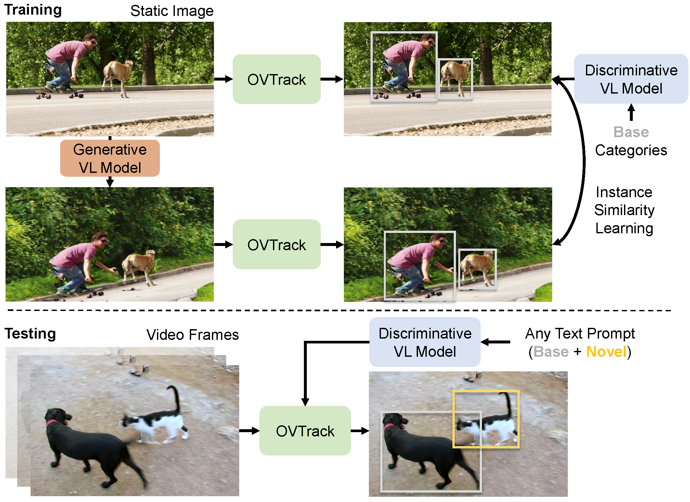
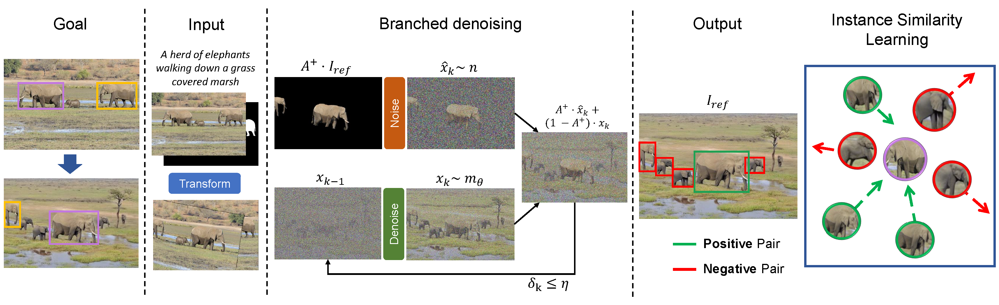
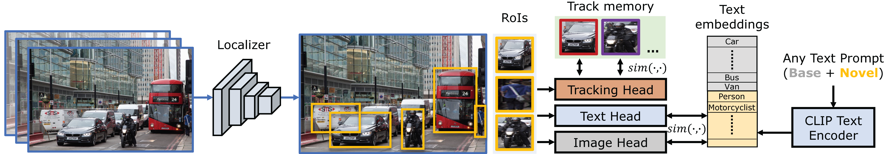

# OVTrack: Open-Vocabulary Multiple Object Tracking [CVPR 2023]

## Abstract

The ability to recognize, localize and track dynamic objects in a scene is fundamental to many real-world applications, such as self-driving and robotic systems. 
Yet, traditional multiple object tracking (MOT) benchmarks rely only on a few object categories that hardly represent the multitude of possible objects that are encountered in the real world. 
This leaves contemporary MOT methods limited to a small set of pre-defined object categories. 
In this paper, we address this limitation by tackling a novel task, open-vocabulary MOT, that aims to evaluate tracking beyond pre-defined training categories. 
We further develop OVTrack, an open-vocabulary tracker that is capable of tracking arbitrary object classes. 
Its design is based on two key ingredients: First, leveraging vision-language models for both classification and association via knowledge distillation; second, a data hallucination strategy for robust appearance feature learning from denoising diffusion probabilistic models. 
The result is an extremely data-efficient open-vocabulary tracker that sets a new state-of-the-art on the large-scale, large-vocabulary TAO benchmark, while being trained solely on static images.
## OVTrack


We approach the task of open-vocabulary multiple object tracking. During training, we leverage vision-language (VL) models both for generating samples and knowledge distillation. During testing, we track both base and novel classes unseen during training by querying a vision-language model.

## Generative VL model



## Discriminative VL model


## Main results
Our method outperforms the states of the art on BDD100K, and TAO benchmarks.

### TETA benchmark

| Method                                              | backbone   | pretrain     | TETA | LocA | AssocA | ClsA | config                                                          | model                                                                                              |                                                                                                  
|-----------------------------------------------------|------------|--------------|------|------|--------|------|-----------------------------------------------------------------|----------------------------------------------------------------------------------------------------|
| [QDTrack(CVPR21)](https://arxiv.org/abs/2006.06664) | ResNet-101 | ImageNet-1K  | 30.0 | 50.5 | 27.4   | 12.1 | -                                                               | -                                                                                                  |                                                                                                     
| TETer                                               | ResNet-101 | ImageNet-1K  | 33.3 | 51.6 | 35.0   | 13.2 | -                                                               | -                                                                                                  |                                                                                          
| **OVTrack**                                         | ResNet-50  | ImageNet-1K  | 34.7 | 49.3 | 36.7   | 18.1 | [cfg](configs/ovtrack-teta/ovtrack_r50_no_dynamic_threshold.py) | [google drive](https://drive.google.com/file/d/1vDAFRmuNMCwhKtW7KHONpzkooLysU8nX/view?usp=sharing) |
| **OVTrack** (dynmaic rcnn threshold )               | ResNet-50  | ImageNet-1K  | 36.2 | 53.8 | 37.3   | 17.4 | [cfg](configs/ovtrack-teta/ovtrack_r50.py)                      | [google drive](https://drive.google.com/file/d/1vDAFRmuNMCwhKtW7KHONpzkooLysU8nX/view?usp=sharing) | 
**Note**: The result with dynmaic rcnn threshold is obtained by setting `model.roi_head.dynamic_rcnn_thre = True` in the config file. It dynamic adjusts rcnn score threshold based on the number of interested classes to track. Please note that the model is the same as the one without dynamic rcnn threshold. The only difference is the rcnn score threshold during inference.

### TAO benchmark
| TAO benchmark      | backbone   | Track AP50 | Track AP75 | Track AP | config                                    | model                                                                                                 |
|--------------------|------------|-----------|-----------|---------|-------------------------------------------|-------------------------------------------------------------------------------------------------------|
| SORT-TAO (ECCV 20) | ResNet-101 |       13.2 | -         | -       | -                                         | -                                                                                                     |
| QDTrack (CVPR21)   | ResNet-101 |       15.9 |          5 |     10.6 | -                                         | -                                                                                                     |
| GTR (CVPR 2022)    | ResNet-101 |      20.4 | -         | -       | -                                         | -                                                                                                     |
| TAC (ECCV 2022 )   | ResNet-101 |      17.7 |       5.8 |     7.3 | -                                         | -                                                                                                     |
| BIV (ECCV 2022)    | ResNet-101 |      19.6 |       7.3 |    13.6 | -                                         | -                                                                                                     |
| **OVTrack**        | ResNet-50  |      21.2 |      10.6 |    15.9 | [cfg](configs/ovtrack-tao/ovtrack_r50.py) | [google drive](https://drive.google.com/file/d/1vDAFRmuNMCwhKtW7KHONpzkooLysU8nX/view?usp=sharing) |

### Open-vocabulary Results (val set)

|                Method                | Classes Base | Classes Novel |  Data LVIS  | Data TAO | Base TETA | Novel TETA |                                      config                                      |                                                 model                                                 |
|:------------------------------------:|:------------:|:-------------:|:-----------:|:---------:|:---------:|:----------:|:--------------------------------------------------------------------------------:|:-----------------------------------------------------------------------------------------------------:|
|               QDTrack                |      ✓       |       ✓       |      ✓      |     ✓    |   27.1    |    22.5    |                                        -                                         |                                                   -                                                   |
|                TETer                 |      ✓       |       ✓       |      ✓      |     ✓    |   30.3    |    25.7    |                                        -                                         |                                                   -                                                   |
|           DeepSORT (ViLD)            |      ✓       |               |      ✓      |     ✓    |   26.9    |    21.1    |                                        -                                         |                                                   -                                                   |
|          Tracktor++ (ViLD)           |      ✓       |               |      ✓      |     ✓    |   28.3    |    22.7    |                                        -                                         |                                                 -                                                     |
|             **OVTrack**              |      ✓       |               |      ✓      |          | **35.5**  |  **27.8**  |         [cfg](configs/ovtrack-teta/ovtrack_r50_no_dynamic_threshold.py)          | [google drive](https://drive.google.com/file/d/1vDAFRmuNMCwhKtW7KHONpzkooLysU8nX/view?usp=sharing) |
| **OVTrack** (dynmaic rcnn threshold) |      ✓       |               |   ✓         |          | **37.1**  |  **28.8**  |                    [cfg](configs/ovtrack-teta/ovtrack_r50.py)                    |  [google drive](https://drive.google.com/file/d/1vDAFRmuNMCwhKtW7KHONpzkooLysU8nX/view?usp=sharing)                                                                                                  |

**Note**: The result with dynmaic rcnn threshold is obtained by setting `model.roi_head.dynamic_rcnn_thre = True` in the config file. It dynamic adjusts rcnn score threshold based on the number of interested classes to track. Please note that the model is the same as the one without dynamic rcnn threshold. The only difference is the rcnn score threshold during inference.

## Installation

Please refer to [INSTALL.md](docs/INSTALL.md) for installation instructions.


## Usages
The repo is still under construction. This is an example usage.
Please refer to [GET_STARTED.md](docs/GET_STARTED.md) for dataset preparation and running instructions.

## Cite OVTrack

```
@inproceedings{li2023ovtrack,
  title={OVTrack: Open-Vocabulary Multiple Object Tracking},
  author={Li, Siyuan and Fischer, Tobias and Ke, Lei and Ding, Henghui and Danelljan, Martin and Yu, Fisher},
  booktitle={Proceedings of the IEEE/CVF Conference on Computer Vision and Pattern Recognition},
  pages={5567--5577},
  year={2023}
}
```

## Acknowledgement
- Thanks [TETA](https://github.com/SysCV/tet) for providing the evaluation code.
- Thanks [DetPro](https://github.com/dyabel/detpro) for providing the pytorch reimplementation of VilD.
- Thanks [RegionCLIP](https://github.com/microsoft/RegionCLIP) for providing the detection on TAO dataset.
